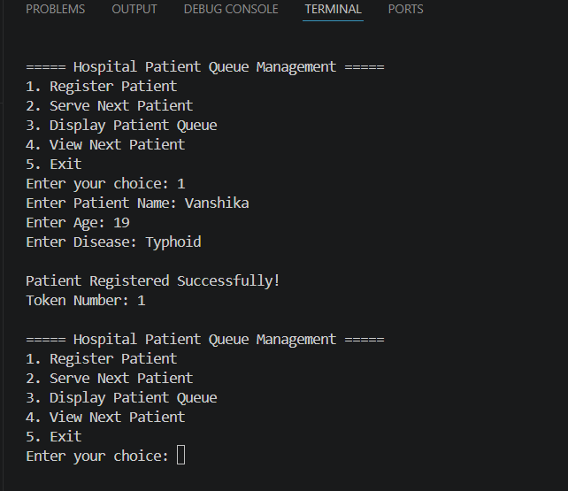

# Hospital Patient Queue Management System

A simple **C++ console-based Hospital Patient Queue Management System** that demonstrates the implementation of the **Queue (FIFO)** data structure. The application helps manage patients waiting for consultation by assigning token numbers, maintaining the waiting queue, and serving patients in the order of arrival.

---

## Features

- Register new patients
- Automatic token generation
- Display all patients in the queue
- View the next patient
- Serve the next patient (FIFO)
- Menu-driven interface
- Simple console application

---

## Technologies Used

- **Language:** C++
- **Concepts:** Queue (FIFO), Structures, STL Queue
- **IDE:** Visual Studio Code
- **Compiler:** g++

---

## Project Structure

```
Hospital-Patient-Queue-Management/
│
├── p.cpp          # Source code
├── output.png     # Sample output screenshot
└── README.md      # Project documentation
```

---

## Menu

```
1. Register Patient
2. Serve Next Patient
3. Display Patient Queue
4. View Next Patient
5. Exit
```

---

## Sample Output



---

## Concepts Used

- Queue (FIFO)
- Structures
- STL Queue
- Functions
- Loops
- Switch Case
- Menu-Driven Programming

---

## Learning Objectives

This project demonstrates how the **Queue** data structure can be used to solve a real-world hospital management problem by organising patients efficiently and serving them in the order of arrival.

---

## Future Enhancements

- Emergency patient priority
- Search patient by token number
- Patient appointment scheduling
- File handling for permanent record storage
- Graphical User Interface (GUI)
- Database integration

---

## Author

**Vanshika Agarwal**

B.Tech (CS-IT)

## ⭐ If you found this project helpful, don't forget to star the repository!
